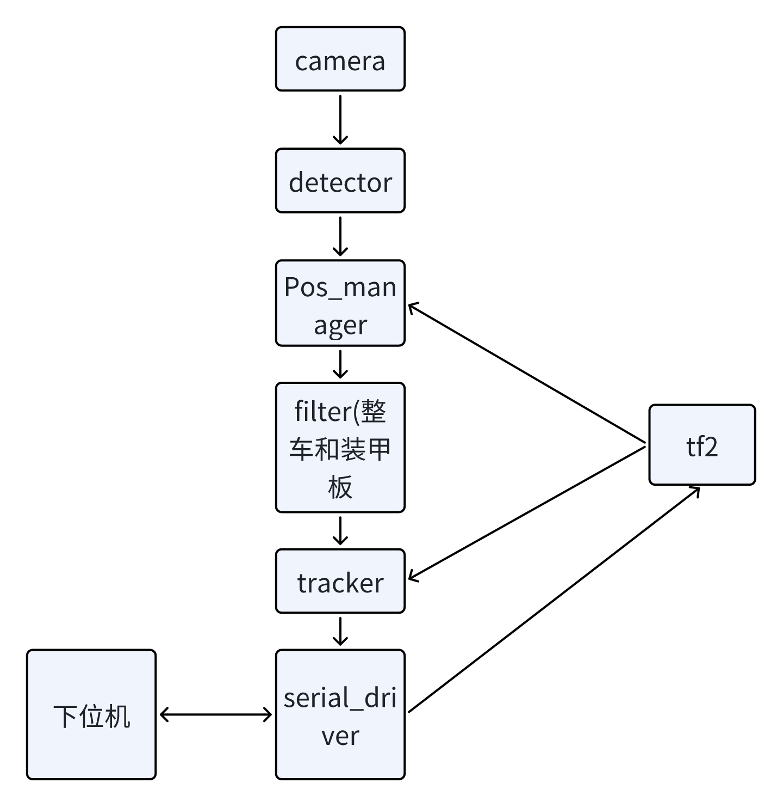
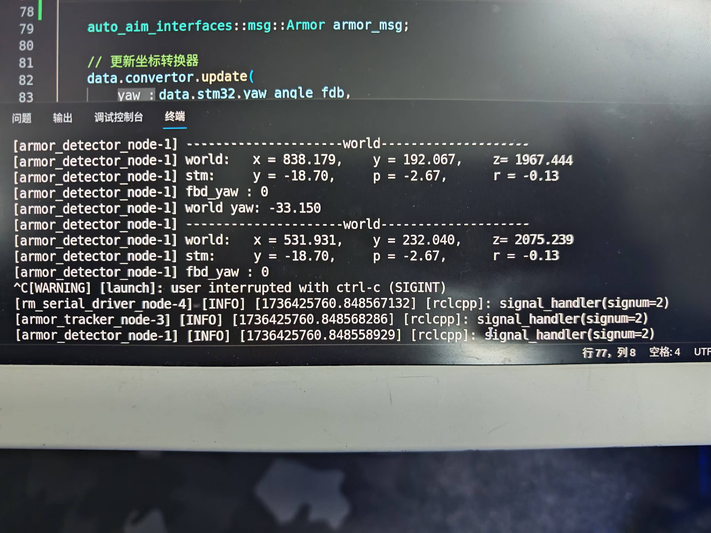

# 目录

- [目录](#目录)
- [0.写在开头](#0写在开头)
- [1.一个更好的开发环境](#1一个更好的开发环境)
  - [1.1 一键部署环境](#11-一键部署环境)
  - [1.2 虚拟机](#12-虚拟机)
  - [1.3 双系统](#13-双系统)
  - [1.4 Docker](#14-docker)
    - [1.4.1 什么是Docker](#141-什么是docker)
    - [1.4.2 核心概念](#142-核心概念)
    - [1.4.3 Docker的优势](#143-docker的优势)
    - [1.4.4 Docker的缺点](#144-docker的缺点)
  - [1.5 WSL2](#15-wsl2)
- [2.ROS2框架下的自瞄程序](#2ros2框架下的自瞄程序)
  - [2.1 camera](#21-camera)
  - [2.2 mix\_detector](#22-mix_detector)
  - [2.3 pos\_manager](#23-pos_manager)
  - [2.4 Filter](#24-filter)
    - [2.4.1 Whole\_EKF\_Filter（整车扩展卡尔曼滤波）](#241-whole_ekf_filter整车扩展卡尔曼滤波)
    - [2.4.2 Single\_CA\_Filter（单体匀加速度滤波）](#242-single_ca_filter单体匀加速度滤波)
  - [2.5 Tracker](#25-tracker)
  - [2.6 Serial\_Driver](#26-serial_driver)
- [3.实际测试与改进](#3实际测试与改进)
  - [3.1 曝光率与识别问题](#31-曝光率与识别问题)
  - [3.2 与下位机的数据对齐问题](#32-与下位机的数据对齐问题)
  - [3.3 Filter的时间戳单位问题](#33-filter的时间戳单位问题)
  - [3.4 图像作为话题信息传输的问题](#34-图像作为话题信息传输的问题)
  - [3.5 tf的对齐问题](#35-tf的对齐问题)
- [4.后期改进思路](#4后期改进思路)
  - [4.1 图像处理的帧率问题](#41-图像处理的帧率问题)
  - [4.2 回调函数的线程问题](#42-回调函数的线程问题)
  - [4.3 硬件的执行问题](#43-硬件的执行问题)
  - [4.4 行为树的问题](#44-行为树的问题)
- [5.我的学习计划](#5我的学习计划)

# 0.写在开头

在2024年暑假，我通过北京理工大学机器人队的夏招加入了视觉组。从2024年8月到2025年1月的半年时间里，我有幸在视觉组学习和成长。虽然我在这一过程中取得了一些进展，但大部分成果得益于团队中学长们的前期努力和指导。在这段时间里，我深刻认识到自己还有很多不足，也更加明确了未来需要努力的方向。

我参与的项目中，许多基础性工作和初步成果都是视觉组的学长们留下的，他们的工作为我的学习提供了很好的起点。在此基础上，我与队友们进行了合作，尝试改进和优化现有的算法和工具。尽管这些改进仍有许多需要完善的地方，但我从中获得了许多宝贵的经验，尤其是在团队合作、问题分析与解决方面。

作为一项具有挑战性的机器人竞赛，RoboMaster 提供了一个实践平台，让我有机会将学到的知识应用于实际场景(事实上,我深感在课堂上学习的东西太少,这促使我去不断地自主学习)。尽管在比赛准备过程中，我遇到了不少困难，但也正是在这些挑战中，我得到了很多锻炼。通过调试和优化，我逐步熟悉了 ROS2、OpenCV、Git 等工具，虽然过程中依然有很多技术问题没有完美解决，但这为我未来的学习打下了基础。

为了将这半年在视觉组的工作进行总结，我选择了将我的一些思考和成果以 Markdown 文件的形式记录(个人认为如果要上传到GitHub,Markdown比Word等文件更加方便)，并上传到我的[学习仓库](https://github.com/windiff886/cs_self_learning)中。这个仓库中记录了我的自学成果.

回顾这段时间的经历，虽然我在技术上还有很多需要提升的地方，但通过这次经历，我对机器人视觉领域有了更加深入的了解，也体会到了团队合作和实践的重要性。这段经历让我更加清楚地意识到自己的短板，并激励我在未来不断改进和进步。

# 1.一个更好的开发环境

“工欲善其事，必先利其器。”一个良好的开发环境对提升开发效率至关重要。对于机器人开发来说，最理想的系统莫过于 Linux Ubuntu，而在开发语言方面，个人认为 C/C++ 是最佳选择。尽管学校曾教授过 C++ 课程，但这门课程仅覆盖了最基础的 C++ 语法，未涉及 CMake、Makefile、优秀的 IDE/编辑器以及开发环境等关键工具和配置。这使得我们在自学的过程中遇到了不少困难和挫折。

为了帮助那些有志于加入视觉组的成员，特别是新加入的成员，能够更快速地搭建一个高效的开发环境，我们开发了一些工具和教程。希望通过这些工具和资源，能够减少大家在环境搭建上的时间投入，帮助他们专注于更有挑战性和创造性的开发工作。

## 1.1 一键部署环境

写一段与视觉相关的代码时，通常需要引用各种外部库。对于C++初学者而言，配置开发环境无疑是一个繁琐且不太舒适的过程。参考小鱼的一键部署环境指令：```wget http://fishros.com/install -O fishros && . fishros```，我们开发了一个专门的一键部署工具。只需克隆我们的仓库并在终端中运行```python3 install.py```，就能自动为你配置所需的开发环境。

我认为，这个项目的优势主要体现在以下几个方面：

+ 简化新手入门：自动化配置开发环境，特别是当初学者不熟悉编译和系统变量配置等复杂过程时，能够显著减少入门门槛。
+ 解决访问墙问题：我们的仓库托管在Gitee上，内含OpenCV、OpenVino等外部库的源码，避免了由于翻墙问题导致无法下载外部库的困扰（虽然翻墙已是基本操作，但能省则省）。
+ 版本统一：我们会在环境配置过程中指定所需的库版本，避免因库版本不一致而带来的兼容性问题。
+ 附加工具安装：自动安装一些实用工具，如SSH和远程连接工具NoMachine，进一步提升开发效率。

当然，项目也有一些不足，主要体现在编译过程中可能会遇到外部依赖错误或编译所需硬件资源过多导致程序崩溃等问题。不过，在我们的ROS2生态系统彻底成型之前，这个项目依然大有可为。

## 1.2 虚拟机

对于初学者，我们推荐通过虚拟机来使用Ubuntu。虚拟机（Virtual Machine，简称VM）是一种能够模拟物理计算机的虚拟化技术。通过在物理硬件上运行虚拟机管理程序（Hypervisor），可以在同一台物理机器上创建多个虚拟操作系统实例。每个虚拟机都拥有独立的操作系统、应用程序和硬件资源，从而实现资源的隔离和独立运行。

在我们制作的教程中，使用了VMware来安装虚拟机。尽管虚拟机技术带来了许多便利，但它也存在一些显著的缺点：

+ 性能开销：虚拟机依赖于宿主操作系统和虚拟化软件，因此会产生一定的性能损耗。尽管现代硬件支持虚拟化加速，虚拟机的性能仍通常低于原生操作系统，尤其是在需要大量计算资源的场景中。最简单的例子是，当你编译大型项目时，虚拟机可能会因资源消耗过大而崩溃。

+ 资源占用：每个虚拟机都需要一定的CPU、内存和存储资源。随着虚拟机数量的增加，宿主系统的资源消耗也会相应增加，可能导致系统负载过重，尤其是在硬件资源有限的情况下（为了应对这一问题，许多队员已经将自家电脑升级到了32GB内存）。

+ 硬件兼容性问题：某些虚拟化平台可能与特定硬件的兼容性较差，导致某些硬件功能（如GPU加速或外部设备支持）无法完全发挥作用。例如，如果你打算将摄像头连接到虚拟机中，可能会遇到兼容性问题。

+ 图形化界面较弱：由于虚拟机的机制，VMware的图形化界面体验较差。我们通常建议在不需要使用图形界面的情况下，通过Windows系统中的VSCode通过SSH连接虚拟机进行开发。

+ 翻墙问题令人头疼：如果你没有找到适用于Ubuntu的VPN工具，想要通过Windows中的VPN来为虚拟机翻墙将变得非常麻烦。

## 1.3 双系统

虽然双系统方案能够克服虚拟机的性能限制，且网络上有大量详细的安装教程可供参考，但基于实际使用经验，我不建议采用双系统作为首选方案。主要有以下两点考虑：

1. 系统稳定性：Ubuntu作为开源操作系统，虽然具有强大的功能，但在日常使用中可能会遇到一些系统崩溃或驱动兼容性问题。

2. 软件生态：相比Windows平台，Ubuntu的软件生态相对不够完善，许多常用软件缺乏Linux版本或其功能受限，这可能会影响日常办公和学习效率。

基于以上考虑，我们找到了两种更为可行的替代方案。

## 1.4 Docker

### 1.4.1 什么是Docker
Docker是一个开源的应用容器引擎，它让开发者可以：
- 将应用及其依赖打包到一个可移植的容器中
- 实现"一次构建，到处运行"
- 保证开发、测试和生产环境的一致性

### 1.4.2 核心概念
- **镜像(Image)**: 只读的模板，包含运行应用所需的所有内容
- **容器(Container)**: 镜像的运行实例，可以被启动、停止、删除
- **仓库(Repository)**: 集中存放镜像文件的场所

### 1.4.3 Docker的优势
- 轻量级：容器共享主机OS，启动快速
- 性能好：内存、cpu核数等都与电脑共享，能达到理论性能最优
- 一致性：消除"在我机器上能运行"的问题
- 隔离性：应用间互不影响
- 易于扩展：快速部署和更新

### 1.4.4 Docker的缺点

我们制作了一个Docker的镜像，打开即可完美运行我们的代码，但是Docker还有一些问题，例如缺少图形化界面的支持以及使用上不那么稳定。

## 1.5 WSL2

WSL2和Docker息息相关，个人认为WSL2胜在拥有更加详细完善的官方教程，也拥有许多别的功能例如图形化界面，同时WSL2与Windows系统完美兼容。我现在主要使用WSL2.

致命缺点：使用VPN并且开启镜像的网络模式的时候ROS2的通讯有问题

# 2.ROS2框架下的自瞄程序

从2024年9月到12月，我们致力于构建一个基于ROS2框架的自瞄程序。在此过程中，我的队友们将各个核心功能封装成类交给我，而我则负责对这些类进行适当的改造，并将其组装成一个个ROS2节点。同时，我也为项目添加了一些ROS2特有的功能。项目后期，在编写文档时，我绘制了一个简单的流程图。



这个流程图是我在初期构思时设计的，但在实际测试过程中，发现其中存在一个致命问题，暂时先不详细讨论。接下来，我将简单介绍各个模块的功能。

## 2.1 camera

相机节点作为系统的输入端，其核心功能是图像的采集与发布。虽然从功能定位上看较为单一，但其稳定性和性能对整个视觉系统至关重要。该节点主要负责相机驱动的加载、参数配置以及图像数据的ROS话题发布。在项目初期，我没有过多关注这一模块，但后期测试过程中发现相机节点仍有许多上升空间，需要增添更多功能以提升系统的整体表现。

## 2.2 mix_detector

detector节点负责从相机节点订阅图像数据，进行装甲板检测，并输出装甲板中心点在图像平面的二维坐标。下图展示了实际中需要识别的装甲板样例：


目前，我们采用传统视觉方法和YOLOv8深度学习模型相结合的方案进行装甲板检测。其中，传统视觉方法的处理流程如下：

1. 基于装甲板特征（红/蓝灯条）进行颜色通道提取
2. 图像预处理：灰度化、二值化、高斯滤波
3. 轮廓检测与筛选，提取符合条件的灯条
4. 灯条匹配，根据位置和几何关系将配对的灯条组合为完整装甲板

我们的detector被命名为"mix"，是因为它巧妙地融合了两种识别方法。具体工作流程如下：

1. 首先使用YOLOv8深度学习模型对输入图像进行推理，获取装甲板的关键信息：
   - 四个顶点坐标
   - 装甲板颜色
   - 装甲板编号(ID)

2. 基于YOLOv8的检测结果，我们：
   - 连接四个顶点形成检测框
   - 适当扩大检测框范围
   - 在扩大后的区域内应用传统视觉方法识别灯条
   
3. 最后将传统视觉识别到的灯条与深度学习的推理结果进行匹配验证

这种混合方案充分利用了两种方法的优势，既保证了检测的准确性，又提高了系统的鲁棒性。

## 2.3 pos_manager

pos_manager负责处理detector的检测结果，通过一系列坐标变换计算得到装甲板的空间位置信息。具体计算流程如下：

1. **PnP位姿解算**
   - 输入：装甲板四个顶点的图像坐标
   - 已知：标准装甲板的实际物理尺寸（比赛规定）
   - 输出：装甲板在相机坐标系下的三维位置

2. **坐标系转换**
   - 从tf树获取机器人姿态信息（yaw、pitch、roll）
   - 利用相机到机器人中心的固定位移关系
   - 将装甲板坐标从相机坐标系转换至世界坐标系

3. **目标角度计算**
   - 基于相机标定参数（内参矩阵、畸变系数）
   - 结合装甲板空间位置信息
   - 计算装甲板相对于我们的偏航角（yaw）

这种多步骤的坐标变换方案确保了位置解算的精确性，为后续的预测和控制提供可靠的空间信息。

## 2.4 Filter

滤波器模块在视觉系统中扮演着关键角色，主要用于优化坐标数据的精确度，并通过计算速度和加速度实现目标预测。我们的滤波系统分为两个层次：装甲板级别的单体滤波和车辆级别的整车滤波。

### 2.4.1 Whole_EKF_Filter（整车扩展卡尔曼滤波）

在RoboMaster比赛中，每台机器人均配备多块相同ID和颜色的装甲板。整车滤波器的工作流程如下：

1. **装甲板分类与匹配**
   - 基于装甲板ID进行分类
   - 与历史帧数据进行时序匹配

2. **状态估计与更新**
   通过扩展卡尔曼滤波（EKF）算法估计以下状态量：
   - 整车空间位置
   - 可见装甲板数量
   - X/Z方向速度分量
   - 相对偏航角及角速度

### 2.4.2 Single_CA_Filter（单体匀加速度滤波）

针对单个装甲板的专用滤波器，采用匀加速度（Constant Acceleration, CA）模型进行状态估计：
- 装甲板三维空间位置
- 速度和加速度分量
- 相对偏航角

## 2.5 Tracker

Tracker模块是自瞄系统的最终执行单元，负责目标决策和射击解算。其核心功能包括：

1. **目标选择**
   - 综合分析装甲板位置、速度和加速度信息
   - 考虑己方机器人弹速等参数
   - 选择最优打击目标

2. **射击解算**
   - 精确计算枪管所需转向角度（yaw和pitch）
   - 补偿弹道下坠和空气阻力影响
   - 输出最终瞄准指令

3. **追踪策略**
我们设计了三种追踪方案：
   - 基于单装甲板滤波（当前采用）
   - 基于整车状态估计
   - 混合策略（待优化）

目前系统采用基于单装甲板滤波的追踪方案，后续将重点优化混合追踪策略以提升系统性能.

## 2.6 Serial_Driver

Serial_Driver是系统的通信节点，主要负责视觉系统与机器人下位机之间的数据交换。其核心功能包括：

1. **数据发送**
   - 将Tracker计算得到的目标信息传输至下位机
   - 实时更新机器人控制指令

2. **数据接收**
   - 从下位机获取机器人姿态信息（yaw、pitch、roll）
   - 接收其他必要的状态参数

3. **坐标转换管理**
   目前系统涉及两个主要坐标系：
   - 相机坐标系
   - 世界坐标系（机器人中心）

为了提供更好的可扩展性（如后续可能引入机械臂等新模块），我们采用ROS2的tf2框架来管理坐标转换。tf2作为ROS2的核心功能之一，提供了类似于话题（Topic）机制的坐标转换发布与订阅功能，使系统的坐标变换更加灵活和规范。

# 3.实际测试与改进

在考试周结束前，我们完成了上述视觉系统的全部模块开发，并通过单元测试验证了各个模块的基本功能。随后在为期近三周的寒假留校期间，我们着手将系统部署到实际机器人平台上进行测试和优化。

尽管我们最初信心满满，认为几天时间足以完成系统调试，但现实远比预期要复杂得多。直到离校前，这套系统仍未能达到可用状态，这也让我们深刻认识到虚拟场景与实际应用场景之间的巨大差异。

在测试初期，我们首先解决了一些基础性问题，包括相机驱动的完善、下位机通信的优化以及项目架构的调整。然而，第一次实车测试时，系统表现出严重的瞄准偏差，甚至无法锁定目标车辆。经过持续的调试和优化，到测试结束时，系统已经能够稳定地追踪目标，只是在枪管仍存在轻微抖动问题。虽然没有完全达到预期目标，但这段时间的测试也取得了显著进展。

下面，我将按照时间顺序记录几个给我留下深刻印象的技术问题及其解决过程。

## 3.1 曝光率与识别问题

经过初步分析，我们决定首先排查detector和pos_manager模块的问题。为此，我们设计了一个简单但有效的对照实验：让实验车辆和目标车辆均保持静止状态。在这个看似简单的测试中，我们发现了一个令人困惑的现象。



从上图输出的数据可以看出，尽管两辆车都处于静止状态，但相邻两帧计算得到的世界坐标却存在显著差异。经过团队讨论和系统调试，我们最终定位到问题根源：相机曝光值设置过高导致图像亮度太高，这不仅影响了YOLOv8的检测效果，也干扰了传统视觉的正常工作。

通过调低相机曝光参数，我们观察到连续帧间的世界坐标计算结果趋于稳定。为了验证计算精度，我们使用卷尺进行实地测量，确认了优化后的世界坐标计算结果与实际位置相符。

## 3.2 与下位机的数据对齐问题

解决了目标识别问题后，我们转而处理云台控制异常的问题。每次启动自瞄程序时，云台都会急速转向某个方向直至达到机械限位。通过数据分析，我们发现tracker模块输出的控制指令是正常的，这表明问题可能出在下游环节。

经过与电控组成员的沟通，我们发现问题出在数据处理上：下位机程序错误地将接收到的yaw和pitch角度值放大了100倍。这个简单的数值转换错误导致了云台的异常运动。修正这一问题后，云台的控制表现恢复正常。

## 3.3 Filter的时间戳单位问题

解决了前述问题后，我们将注意力转向云台抖动问题——即使在目标保持静止的情况下，云台仍然存在明显的抖动现象。通过与队友的技术交流，我们发现了一个关键问题：Filter模块中存在时间单位不一致的情况。

具体来说，这个问题涉及到消息传递链中的时间戳处理：
1. 时间戳最初在camera节点由ROS2生成，并通过消息header向后传递
2. 在Filter节点中，输入接口使用"秒"作为时间单位
3. 而Filter的具体实现中却使用"毫秒"作为计算单位

这个时间单位不统一的问题导致了滤波计算的误差，进而引起云台控制的抖动。修正单位换算问题后，云台的稳定性得到了显著改善。这个经验提醒我们在系统设计时需要特别注意单位统一性，以避免类似的计算误差。

## 3.4 图像作为话题信息传输的问题

必须承认,我们并没有对ROS2图像传输的效率进行仔细的研究.在我们构建ROS2的框架的实验的同时,在一次性能测试中，队友构建了一个基于传统视觉算法的测试节点，通过对比实验发现：

- 通过ROS2话题传输图像时，单帧处理耗时15-20ms
- 直接读取本地图像时，单帧处理仅需5-10ms
  
我们据此推断,图像作为话题信息传输所带来的时间消耗是极为可观的.

经过一番研究,我们将识别节点(detector)和相机节点(camera)放到一个进程中,采用共享内存的方法来传输图像,两个节点不再传递图像,而是传递图像的指针.

遗憾的是,由于此时已经临近回家,我们并没有对这一方法的效果和稳定性做详细的测试.

## 3.5 tf的对齐问题

这里涉及到最初的流程图问题.在我的构想中,camera节点获取图像,通讯节点发布tf信息,pos_manager在做坐标转换的时候要接受一次tf信息,tracker在计算角度的时候也要接受一次tf信息.

这里便暴露了一个严重的问题,由于程序的执行需要时间,camera节点处的图像,pos_manager处的tf信息,tracker处的tf信息,三个重要的信息却对应着不同的时间点.我们认为这是使得我们的云台抖动的重要原因.

这个问题我们仍未解决,我认为这里的难点有下:

+ 图像来自相机,tf信息来自下位机,两者必定存在时间差,我们并未测量时间差对程序效果的具体影响
+ 理想情况下,获取图像的频率和tf信息的发送频率应当相同,但是我们获取图像的频率并不是固定值,这里可能需要和电控进行一段时间的联调
+ ROS2有tf2的缓冲机制,可以储存一段时间内收到的tf信息,并且根据从话题接收到的消息包内的时间戳来寻找缓冲区中与之时间对应的信息.但是这个机制与共享内存的方法有一定冲突,并且效果并不太好
+ 基于上面推断,我们可能需要改造ROS2的消息包的时间对齐机制或者自己写一个时间对齐机制

我个人比较倾向的解决方法是从相机节点获取tf信息,并且传输到后续节点.

# 4.后期改进思路

至此，我们三周的寒假调试工作暂告一段落。三周的时间,简单总结下来仅有寥寥数段，不由使人遗憾,但其中蕴含的无数尝试、挫折与思考，却难以用文字完全表达。

在调车的过程中,我们还有许多讨论,有很多都没开始执行,我也总结如下.

## 4.1 图像处理的帧率问题

图像处理效率是影响自瞄系统性能的关键因素。在实际对抗中，系统需要保持至少70fps的处理速率，理想情况下应达到100fps以上。虽然ROS2提供了便捷的帧率测试机制（通过监测tracker节点的消息发布频率），但受限于时间，我们未能进行全面的性能测试。基于当前调试情况来看，在共享内存机制完全优化之前，系统的帧率表现仍有提升空间。

## 4.2 回调函数的线程问题

通过性能分析，我们发现神经网络推理是整个系统最大的性能瓶颈，这与预期相符。进一步的测试显示，detector节点的图像处理速度明显落后于camera节点的图像发布速度。考虑到ROS2回调函数的单线程特性，我们提出了多线程优化方案，以提升图像处理效率。

然而，这种优化方案也带来了新的挑战：在多线程处理中，后续帧的处理可能快于前序帧，这种时序紊乱将导致系统行为异常。如何保证多线程环境下的帧序一致性，是我们需要重点考虑的问题。

## 4.3 硬件的执行问题

关于硬件资源的利用效率，我们尚未进行全面的性能分析。系统在运行时的CPU占用率、GPU利用率、内存使用情况等关键指标都需要进一步测试和优化。这将是未来工作中的重要研究方向之一。

## 4.4 行为树的问题

团队讨论中，有成员建议引入行为树（Behavior Tree）来优化系统的决策逻辑。这是一个很有价值的建议，我们计划在解决当前核心问题后将其列入开发计划。行为树作为一种成熟的AI决策框架，可能会帮助我们实现更智能和灵活的目标选择策略。

# 5.我的学习计划 

时间回到2024年的暑假,在视觉组的入队考核中，我们被要求独立完成一个基于传统视觉方法的装甲板识别任务。这次经历让我深刻认识到传统视觉方法的局限性——它只能处理具有明确特征（如灯条）的目标，在面对复杂多样的识别任务时显得捉襟见肘。要怎么在更加多样复杂的环境中识别物体呢?这一想法在我心中种下了种子.

在本学期的中期,我偶然发现了一个网站[北大CS自学指南](https://csdiy.wiki/),这个网站推荐了来自MIT、UCB、Stanford等高校的优质课程,几乎覆盖了计算机本科教育的全部领域,这给我指引了自学的方向.尽管我自认为成绩不差,但是我已经很久没有听过课,也很久没有在课堂中感受到乐趣和热情了.在当赛博留学生的过程中,我又重拾了对知识的渴望与兴趣.

为了解决我对视觉识别的疑惑,我先后学习了吴恩达教授的[机器学习](https://www.coursera.org/learn/machine-learning)与[深度学习](https://www.coursera.org/specializations/deep-learning).在这之后,我学习了[Umich的ComputerVision课](https://web.eecs.umich.edu/~justincj/teaching/eecs498/WI2022/),在一个个assignment的引导下,我尝试了制作简单的Linear Classifier,搭建简单的两层的神经网络,亲手搭建CNN等.这些经历满足了我对视觉识别的好奇心.

在机器人队的学习的过程中,我主要和计算机打交道,这让我对计算机产生了十足的兴趣.我被CMaksLists、Ubuntu、ROS2折磨了很久,却并不了解这些东西的本质,所以我希望能学习更多的计算机的知识.我希望从UCB的[编程入门课CS61A](https://cs61a.vercel.app/)、[数据结构与算法CS61B](https://sp24.datastructur.es/)、[计算机体系结构CS61C](https://cs61c.org/su20/)开始.在此之后我也希望能了解操作系统、编译原理甚至是计算机网络的知识,不过暂且让我一步一步来吧.

除此之外,我不止满足于在机器人队的学习,我渐渐地对实验室里的工作产生好奇心,等到我对这个领域的了解更加深入,我也希望能进入自己感兴趣的方向的老师的课题组,让自己的生活更加丰富多彩.

总结就到这里吧,祝愿自己能以更加充沛的热情迎接下一学期!