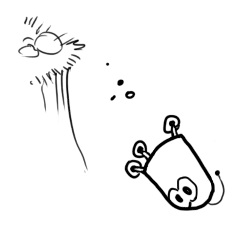

From : https://www.bzarg.com/p/how-a-kalman-filter-works-in-pictures/#mathybits

# What is it

You can use a Kalman filter in any place where you have uncertain information about some dynamic system, and you can make an educated guess about what the system is going to do next. Even if messy reality comes along and interferes with the clean motion you guessed about, the Kalman filter will often do a very good job of figuring out what actually happened. And it can take advantage of correlations between crazy phenomena that you maybe wouldn’t have thought to exploit!

Kalman filters are ideal for systems which are continuously changing. They have the advantage that they are light on memory (they don’t need to keep any history other than the previous state), and they are very fast, making them well suited for real time problems and embedded systems.

The math for implementing the Kalman filter appears pretty scary and opaque in most places you find on Google. That’s a bad state of affairs, because the Kalman filter is actually super simple and easy to understand if you look at it in the right way. Thus it makes a great article topic, and I will attempt to illuminate it with lots of clear, pretty pictures and colors. The prerequisites are simple; all you need is a basic understanding of probability and matrices.

# What can we do with a Kalman filter?

Let’s make a toy example: You’ve built a little robot that can wander around in the woods, and the robot needs to know exactly where it is so that it can navigate.

We’ll say our robot has a state $\vec{x}_k$, which is just a position and a velocity:
         
 $\vec{x}_k = (\vec{p},\vec{v})$

 Note that the state is just a list of numbers about the underlying configuration of your system; it could be anything. In our example it’s position and velocity, but it could be data about the amount of fluid in a tank, the temperature of a car engine, the position of a user’s finger on a touchpad, or any number of things you need to keep track of.

 Our robot also has a GPS sensor, which is accurate to about 10 meters, which is good, but it needs to know its location more precisely than 10 meters. There are lots of gullies and cliffs in these woods, and if the robot is wrong by more than a few feet, it could fall off a cliff. So GPS by itself is not good enough.

 

 We might also know something about how the robot moves: It knows the commands sent to the wheel motors, and its knows that if it’s headed in one direction and nothing interferes, at the next instant it will likely be further along that same direction. But of course it doesn’t know everything about its motion: It might be buffeted by the wind, the wheels might slip a little bit, or roll over bumpy terrain; so the amount the wheels have turned might not exactly represent how far the robot has actually traveled, and the prediction won’t be perfect.

 The GPS sensor tells us something about the state, but only indirectly, and with some uncertainty or inaccuracy. Our prediction tells us something about how the robot is moving, but only indirectly, and with some uncertainty or inaccuracy.

 But if we use all the information available to us, can we get a better answer than either estimate would give us by itself? Of course the answer is yes, and that’s what a Kalman filter is for.

 # How a Kalman filter sees your problem

 Let’s look at the landscape we’re trying to interpret. We’ll continue with a simple state having only position and velocity.

 $\vec{x} = \begin{bmatrix} p \\ v \end{bmatrix}$

 We don’t know what the actual position and velocity are; there are a whole range of possible combinations of position and velocity that might be true, but some of them are more likely than others:

The Kalman filter assumes that both variables (postion and velocity, in our case) are random and Gaussian distributed(also known as normal distribution). Each variable has a mean value μ, which is the center of the random distribution (and its most likely state), and a variance σ2, which is the uncertainty:

In the above picture, position and velocity are uncorrelated, which means that the state of one variable tells you nothing about what the other might be.

The example below shows something more interesting: Position and velocity are correlated. The likelihood of observing a particular position depends on what velocity you have:

This kind of situation might arise if, for example, we are estimating a new position based on an old one. If our velocity was high, we probably moved farther, so our position will be more distant. If we’re moving slowly, we didn’t get as far.

This kind of relationship is really important to keep track of, because it gives us more information: One measurement tells us something about what the others could be. And that’s the goal of the Kalman filter, we want to squeeze as much information from our uncertain measurements as we possibly can!

This correlation is captured by something called a covariance matrix(协方差矩阵). In short, each element of the matrix  Σᵢⱼ is the degree of correlation between the ith state variable and the jth state variable. (You might be able to guess that the covariance matrix is symmetric(对称的), which means that it doesn’t matter if you swap i and j). Covariance matrices are often labelled “Σ”, so we call their elements “ Σᵢⱼ”.

# Describing the problem with matrices

We’re modeling our knowledge about the state as a Gaussian blob, so we need two pieces of information at time k: We’ll call our best estimate $\hat{\mathbf{x}}_k$ (the mean, elsewhere named μ ), and its covariance matrix $\mathbf{P}_k$.

$\hat{\mathbf{x}}_k = \begin{bmatrix} \text{position} \\ \text{velocity} \end{bmatrix}$

$\mathbf{P}_k = \begin{bmatrix} \Sigma_{pp} & \Sigma_{pv} \\ \Sigma_{vp} & \Sigma_{vv} \end{bmatrix}$

(Of course we are using only position and velocity here, but it’s useful to remember that the state can contain any number of variables, and represent anything you want).

Next, we need some way to look at the current state (at time k-1) and predict the next state at time k. Remember, we don’t know which state is the “real” one, but our prediction function doesn’t care. It just works on all of them, and gives us a new distribution:

We can represent this prediction step with a matrix, $\mathbf{F}_k$:

It takes every point in our original estimate and moves it to a new predicted location, which is where the system would move if that original estimate was the right one.

Let’s apply this. How would we use a matrix to predict the position and velocity at the next moment in the future? We’ll use a really basic kinematic formula:

Let’s apply this. How would we use a matrix to predict the position and velocity at the next moment in the future? We’ll use a really basic kinematic formula:

In other words:

We now have a prediction matrix which gives us our next state, but we still don’t know how to update the covariance matrix.

We now have a prediction matrix which gives us our next state, but we still don’t know how to update the covariance matrix.

This is where we need another formula. If we multiply every point in a distribution by a matrix A, then what happens to its covariance matrix Σ?

Well, it’s easy. I’ll just give you the identity:

So combining (4) with equation (3):

# External influence

We haven’t captured everything, though. There might be some changes that aren’t related to the state itself— the outside world could be affecting the system.

For example, if the state models the motion of a train, the train operator might push on the throttle, causing the train to accelerate. Similarly, in our robot example, the navigation software might issue a command to turn the wheels or stop. If we know this additional information about what’s going on in the world, we could stuff it into a vector called $\vec{u}_k$ , do something with it, and add it to our prediction as a correction.

Let’s say we know the expected acceleration a due to the throttle setting or control commands. From basic kinematics we get:

In matrix form:

$\vec{B}_k$ is called the control matrix and $\vec{u}_k$ the control vector. (For very simple systems with no external influence, you could omit these).

Let’s add one more detail. What happens if our prediction is not a 100% accurate model of what’s actually going on?

# External uncertainty

Everything is fine if the state evolves based on its own properties. Everything is still fine if the state evolves based on external forces, so long as we know what those external forces are.

But what about forces that we don’t know about? If we’re tracking a quadcopter, for example, it could be buffeted around by wind. If we’re tracking a wheeled robot, the wheels could slip, or bumps on the ground could slow it down. We can’t keep track of these things, and if any of this happens, our prediction could be off because we didn’t account for those extra forces.

We can model the uncertainty associated with the “world” (i.e. things we aren’t keeping track of) by adding some new uncertainty after every prediction step:

Every state in our original estimate could have moved to a range of states. Because we like Gaussian blobs so much, we’ll say that each point in $\vec{x}_{k-1}$ is moved to somewhere inside a Gaussian blob with covariance $Q_k$. Another way to say this is that we are treating the untracked influences as noise with covariance $Q_k$.

This produces a new Gaussian blob, with a different covariance (but the same mean):

We get the expanded covariance by simply adding $Q_k$, giving our complete expression for the prediction step:

In other words, the new best estimate is a prediction made from previous best estimate, plus a correction for known external influences.

And the new uncertainty is predicted from the old uncertainty, with some additional uncertainty from the environment.

All right, so that’s easy enough. We have a fuzzy estimate of where our system might be, given by $\vec{x}_k$ and $Q_k$. What happens when we get some data from our sensors?

# Refining the estimate with measurements

We might have several sensors which give us information about the state of our system. For the time being it doesn’t matter what they measure; perhaps one reads position and the other reads velocity. Each sensor tells us something indirect about the state— in other words, the sensors operate on a state and produce a set of readings.

Notice that the units and scale of the reading might not be the same as the units and scale of the state we’re keeping track of. You might be able to guess where this is going: We’ll model the sensors with a matrix,$H_k$.

We can figure out the distribution of sensor readings we’d expect to see in the usual way:

One thing that Kalman filters are great for is dealing with sensor noise. In other words, our sensors are at least somewhat unreliable, and every state in our original estimate might result in a range of sensor readings.

From each reading we observe, we might guess that our system was in a particular state. But because there is uncertainty, some states are more likely than others to have have produced the reading we saw:

We’ll call the covariance of this uncertainty (i.e. of the sensor noise) $R_k$. The distribution has a mean equal to the reading we observed, which we’ll call $\vec{z}_k$.

So now we have two Gaussian blobs: One surrounding the mean of our transformed prediction, and one surrounding the actual sensor reading we got.

We must try to reconcile our guess about the readings we’d see based on the predicted state (pink) with a different guess based on our sensor readings (green) that we actually observed.

So what’s our new most likely state? For any possible reading ($z_1$,$z_2$), we have two associated probabilities: (1) The probability that our sensor reading $\vec{z}_k$ is a (mis-)measurement of ($z_1$,$z_2$), and (2) the probability that our previous estimate thinks ($z_1$,$z_2$) is the reading we should see.

If we have two probabilities and we want to know the chance that both are true, we just multiply them together. So, we take the two Gaussian blobs and multiply them:

What we’re left with is the overlap, the region where both blobs are bright/likely. And it’s a lot more precise than either of our previous estimates. The mean of this distribution is the configuration for which both estimates are most likely, and is therefore the best guess of the true configuration given all the information we have.

Hmm. This looks like another Gaussian blob.

As it turns out, when you multiply two Gaussian blobs with separate means and covariance matrices, you get a new Gaussian blob with its own mean and covariance matrix! Maybe you can see where this is going: There’s got to be a formula to get those new parameters from the old ones!

# Combining Gaussians

Let’s find that formula. It’s easiest to look at this first in one dimension. A 1D Gaussian bell curve with variance σ2 and mean μ is defined as:

We want to know what happens when you multiply two Gaussian curves together. The blue curve below represents the (unnormalized) intersection of the two Gaussian populations:

You can substitute equation (9) into equation (10) and do some algebra (being careful to renormalize, so that the total probability is 1) to obtain:

We can simplify by factoring out a little piece and calling it k:

Take note of how you can take your previous estimate and add something to make a new estimate. And look at how simple that formula is!

But what about a matrix version? Well, let’s just re-write equations (12) and (13) in matrix form. If Σ is the covariance matrix of a Gaussian blob, and μ⃗  its mean along each axis, then:

K  is a matrix called the Kalman gain, and we’ll use it in just a moment.

Easy! We’re almost finished!